<h1 align="center">Hi there, I'm RainMoe</h1>
<h3 align="center"> Developer | Frontend & Open Source</h3>

  

---
-  From China, currently studying at **Hunan University of Science and Technology (HNUST)**
-  Expected graduation **2029**
-  Comfortable with **JavaScript**, exploring **Vue.js** and **React**
-  Passionate about **Frontend Development** and open source
-  ACG / anime enthusiast, making code cute and useful

---

###  About Me

  Focused on frontend learning and practice, occasionally dabbling in backend & DevOps 
  I love shipping to GitHub and polishing my homepage and portfolio 
  Goal: build projects that are both practical and adorable

---

###  Tech Stack & Tools

**Backend & DevOps**  

**Frontend**  

**Tools**  

**Theme Palette**:

---

  
  

---
###  Achievements

  
  
  

---
###  Featured Projects

  
  

---
###  Contact

  
  
  
Personal Blog: in progress

  

